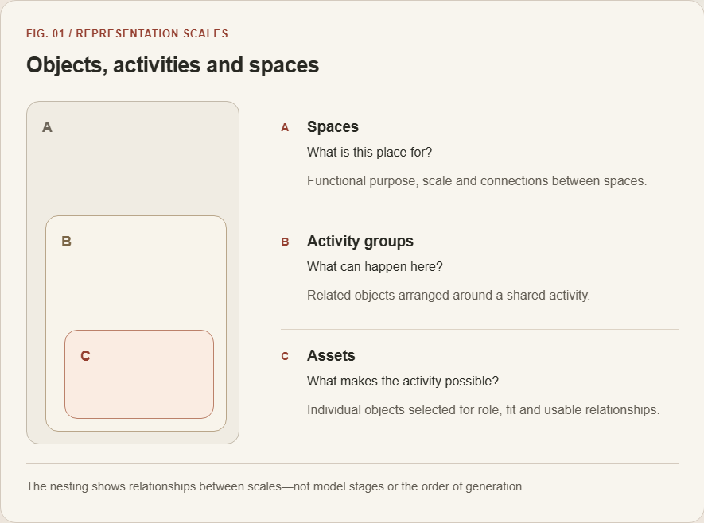

# AIWG: AI World Generator

[中文](README.zh-CN.md) · [Project page](https://ruixiaozhang.com/index_EN#work-aiwg)

A room is more than a collection of plausible objects. Its purpose depends on what people can do there, how objects work together, and whether there is room to move and use them. AIWG explores these relationships across assets, activity groups and spaces.

The nesting shows relationships between scales—not model stages or the order of generation.

The current prototype combines learned asset features with explicit rules. Learned models for activity groups and spaces remain experimental; this is not an end-to-end learned system.

## From similarity to usable space

Embeddings describe aspects of similarity and context. They can help choose related objects, but similarity alone cannot establish access, physical fit or usability. The current hospital prototype combines learned asset features with explicit spatial and interaction rules, followed by inspection and revision in Unreal Engine.

## My work and current limits

I develop the research concept, interaction design and prototype workflow. The three scales organise the problem; they are not three validated learned models. Higher-level learning remains experimental, and its benefit over simple baselines has not been established.

## Work in progress

The work and manuscript are in progress. These scene images show the setting and visual development, not proof of complete interaction reliability or research effectiveness. This page shares the approach and its limits, without training details, experimental figures or player-study results.

## Inside the hospital prototype

### Corridor and circulation

Development scene from the hospital prototype, shown as a lighting study—not evidence of completed interaction tasks.

### A connected multi-storey setting

Development scene from the hospital prototype, shown as a lighting study—not evidence of completed interaction tasks.

### A room organised around use

Development scene from the hospital prototype, shown as a lighting study—not evidence of completed interaction tasks.

## Related pages

[AINPC](https://github.com/Shawn200212/Author-Constrained-AINPC)

[Disclosure](DISCLOSURE.md) · [Image inventory](docs/public-media.json) · [Rights and credits](RIGHTS_AND_CREDITS.md)

Overview updated 26 September 2026. The narrative, conceptual figure and scene images mirror the project website. This repository is a research overview, not a runnable project or a complete research artifact.
