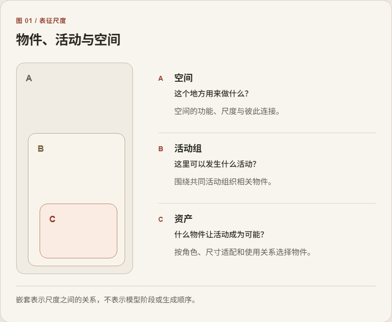
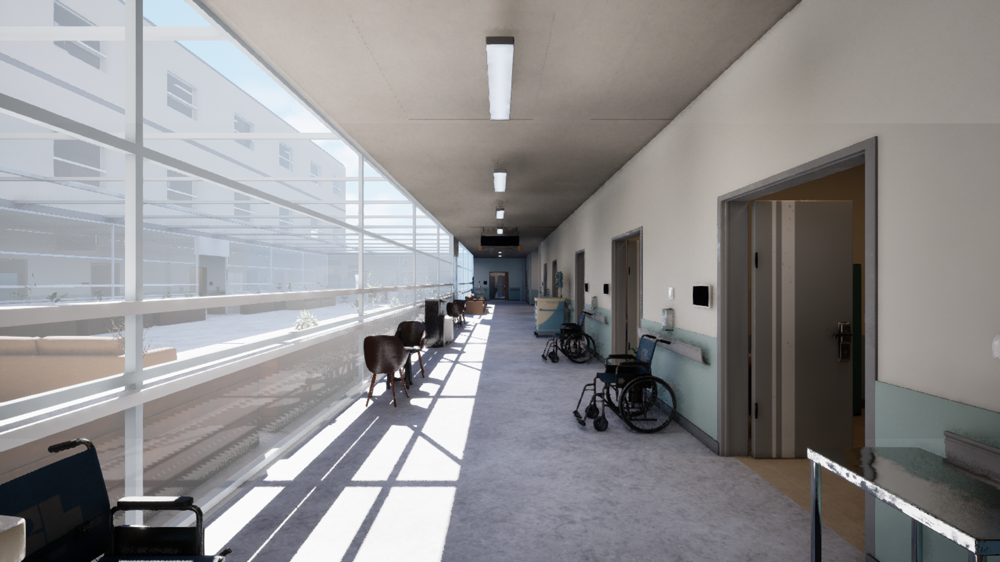
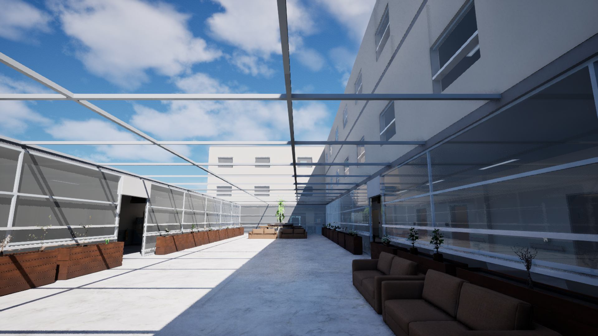
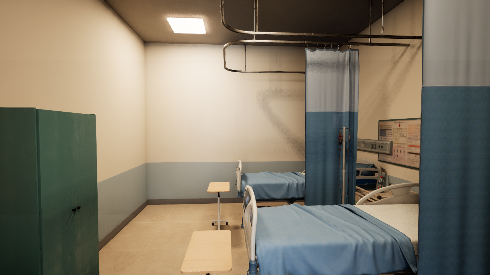

# AIWG: AI 世界生成器

[English](README.md) · [项目网页](https://ruixiaozhang.com/#work-aiwg)

房间不只是一些看起来合理的物件。它的用途取决于人在其中能做什么、物件如何配合，以及是否留出了通行和使用的空间。AIWG 从资产、活动组和空间三个尺度研究这些关系。

嵌套表示尺度之间的关系，不表示模型阶段或生成顺序。

当前原型结合学习得到的资产特征与显式规则。活动组和空间层的学习模型仍在实验中，不是端到端学习系统。

## 从相似物件到可用空间

Embedding 用于描述相似性和使用情境，可以帮助选择相关物件，但相似不等于放得下、走得到或用得了。当前医院原型把学习得到的资产特征与明确的空间、交互规则结合，在 Unreal Engine 中检查并修改生成的环境。

## 我的工作与当前限制

我负责研究构思、交互设计和原型流程开发。三个尺度用于组织问题，不代表三个经过验证的学习模型。高层学习仍处于实验阶段，相对简单基线的收益尚未确立。

## 仍在推进的研究

工程与论文仍在推进。这里的场景图呈现场景和视觉探索，不证明交互已全面可靠或研究方法已经有效。本页只介绍思路与限制，不公开训练细节、实验数字或玩家研究结果。

## 医院原型场景

### 走廊与通行

医院原型的开发场景，呈现灯光探索，不作为交互任务已完成的证据。

### 彼此连通的多层空间

医院原型的开发场景，呈现灯光探索，不作为交互任务已完成的证据。

### 围绕使用组织的房间

医院原型的开发场景，呈现灯光探索，不作为交互任务已完成的证据。

## 相关页面

[AINPC](https://github.com/Shawn200212/Author-Constrained-AINPC)

[公开范围](DISCLOSURE.md) · [图片清单](docs/public-media.json) · [权利与署名](RIGHTS_AND_CREDITS.md)

概览更新于 2026 年 9 月 26 日。正文、概念图和场景图与项目网页保持一致。本仓用于研究介绍，不是可运行工程或完整研究材料。
